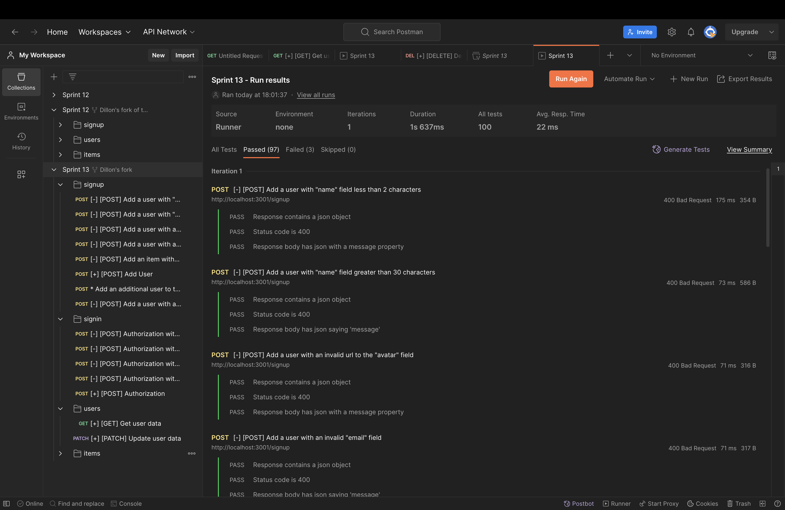

# WTWR (What to Wear?): Back End

This project is the backend half of the WTWR project! Created using Node.js, and express mongoDB. This project uses routes and controllers to fetch, create, and delete items on the front end. The project also authorizes and stores user data safely in the server allowing users to create a secure account on the front-end. The requests were all tested using customized requests via postman to ensure request efficiency and accuracy.

# Images of Requests and Demo server

# The front-end

# You can find the live site to the entire application here:

=> https://dillona25.github.io/WhatToWear/#/

# You can find the front-end code here:

=> https://github.com/Dillona25/WhatToWear
